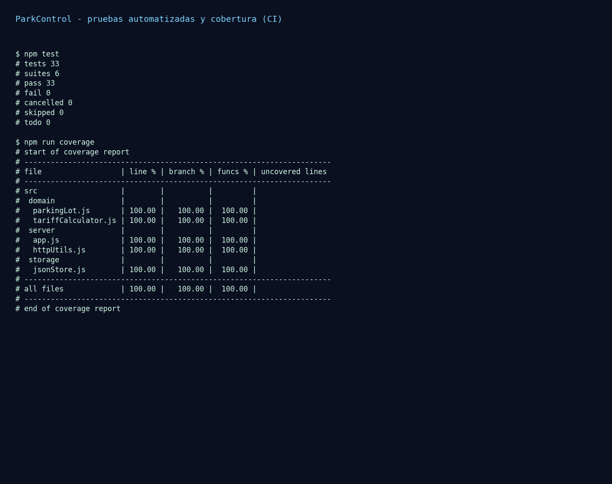

# U4 — Reporte de Integración Continua, Pruebas Automatizadas y CI/CD

**Proyecto:** ParkControl · **Unidad:** Gestión de defectos (pruebas de integración + CI/CD)

Este documento es el **reporte de resultados de ejecución** de la Unidad 4 y
describe los cuatro requisitos obligatorios: script de pruebas automatizadas,
pipeline CI/CD funcional, métricas de cubrimiento y la restricción de
integración (las pruebas se ejecutan automáticamente antes de permitir merges).

---

## 1. Script de pruebas automatizadas

Las pruebas están automatizadas con el runner nativo `node:test` y se ejecutan
con un solo comando. La suite combina **tres niveles**:

| Nivel | Archivo(s) | Qué valida | Comando |
|-------|-----------|------------|---------|
| Unitarias | `test/tariffCalculator.test.js`, `test/parkingLot.test.js`, `test/httpUtils.test.js`, `test/jsonStore.test.js` | Reglas de dominio, cálculo tarifario, utilidades HTTP, persistencia | `npm test` |
| **Integración** | `test/parkingLot.integration.test.js` | Dominio + cálculo tarifario + persistencia JSON trabajando juntos (registro, recarga desde storage, liquidación, factura persistida, bloqueo de duplicados, sobrecupo, consecutivos) | `npm run integration` |
| Servicio / E2E HTTP | `test/app.e2e.test.js` | Servidor HTTP real: `GET /api/dashboard`, `POST /api/entries`, `POST /api/exits`, rutas estáticas y manejo de errores | `npm test` |

Además existe E2E de interfaz con Playwright (`e2e/parking-flow.spec.js`,
`npm run e2e`).

### Resultado de ejecución

```text
$ npm test
# tests 33
# suites 6
# pass 33
# fail 0

$ npm run integration
# tests 3
# suites 1
# pass 3
# fail 0
```



## 2. Métricas de cubrimiento de código

Se usa la cobertura nativa de Node (`--experimental-test-coverage`) con
**umbrales exigidos al 100 %** en líneas, ramas y funciones. Si la cobertura
baja del umbral, el comando **falla** (y con él, el pipeline).

```text
# file                  | line % | branch % | funcs % | uncovered lines
#   parkingLot.js       | 100.00 |   100.00 |  100.00 |
#   tariffCalculator.js | 100.00 |   100.00 |  100.00 |
#   app.js              | 100.00 |   100.00 |  100.00 |
#   httpUtils.js        | 100.00 |   100.00 |  100.00 |
#   jsonStore.js        | 100.00 |   100.00 |  100.00 |
# all files             | 100.00 |   100.00 |  100.00 |
```

Configuración (en `package.json`):

```json
"coverage": "node --test --experimental-test-coverage --test-coverage-include=src/**/*.js --test-coverage-lines=100 --test-coverage-branches=100 --test-coverage-functions=100 test/**/*.test.js"
```

| Métrica | Valor | Umbral | Estado |
|---------|------:|-------:|:------:|
| Cobertura de líneas | 100 % | 100 % | ✅ |
| Cobertura de ramas | 100 % | 100 % | ✅ |
| Cobertura de funciones | 100 % | 100 % | ✅ |
| Pruebas que pasan | 33/33 | 100 % | ✅ |
| Pruebas de integración | 3/3 | 100 % | ✅ |

## 3. Pipeline CI/CD funcional

Definido en `.github/workflows/ci.yml`. Se dispara en **cada push** y en **cada
Pull Request** hacia `main`/`master`, con tres jobs:

| Job | Pasos principales | Propósito |
|-----|-------------------|-----------|
| **`quality`** | `npm ci` → `npm test` → `npm run integration` → `npm run coverage` (gate 100 %) → publica `coverage.txt` | **Gate de merge.** Falla si una prueba falla o si la cobertura baja del 100 %. |
| `e2e` | `npm ci` → `npx playwright install chromium` → `npm run e2e` → publica reporte | Pruebas E2E de interfaz. |
| `performance` | instala JMeter 5.6.3 → `./performance/run_jmeter.sh` → publica `.jtl`, estadísticas y gráficas | Smoke de carga (enlaza con U5). |

Diagrama del flujo:

```
 push / pull_request
        │
        ▼
 ┌─────────────────────────────────────────────┐
 │ job quality (REQUERIDO)                      │
 │  npm ci → npm test → npm run integration     │
 │        → npm run coverage (falla si < 100%)  │
 └─────────────────────────────────────────────┘
   │ verde            │ rojo
   ▼                  ▼
 merge permitido    merge BLOQUEADO
 (+ jobs e2e y performance en paralelo, con artefactos)
```

## 4. Restricción de integración (pruebas antes de merge)

El pipeline ya **ejecuta las pruebas automáticamente en cada Pull Request**. Para
**impedir el merge cuando fallan**, se configura la protección de rama de GitHub
marcando el check `quality` como obligatorio. El procedimiento exacto está en
[`U4-configurar-branch-protection.md`](U4-configurar-branch-protection.md).

Resumen: *Settings → Branches → Add branch ruleset → Require status checks to
pass before merging → seleccionar `quality`*. Con esto, un PR con pruebas en rojo
o con cobertura insuficiente **no puede integrarse**.

## 5. Enfoque Ágil vs Cascada (indicador de desempeño)

| Aspecto | Cascada | Ágil (aplicado aquí) |
|---------|---------|----------------------|
| Cuándo se prueba | Fase final, tras construir todo | Continuo: cada push/PR dispara la suite |
| Detección de defectos | Tardía y costosa | Temprana, antes del merge |
| Trazabilidad | Documento estático | Viva: pruebas ↔ requisitos ↔ defectos (ver `trazabilidad.md` y U6) |
| Automatización | Baja | Alta (CI/CD + cobertura como gate) |

El proyecto adopta el enfoque **Ágil**: la validación es automática, continua y
bloquea la integración de código que rompa pruebas o reduzca la cobertura.

## 6. Conclusión

ParkControl cumple los cuatro requisitos de U4: pruebas automatizadas en tres
niveles (33 + 3 casos, 100 % verdes), cobertura del 100 % usada como gate,
pipeline CI/CD funcional en GitHub Actions y restricción de integración que
ejecuta las pruebas antes de permitir merges. La evidencia es verificable en el
repositorio (`.github/workflows/ci.yml`, `docs/evidencias-u4/`).
