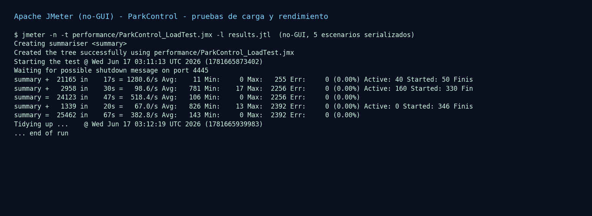
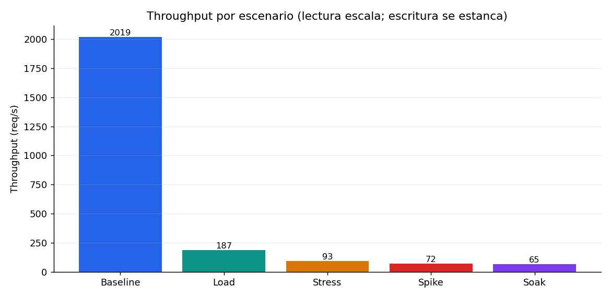
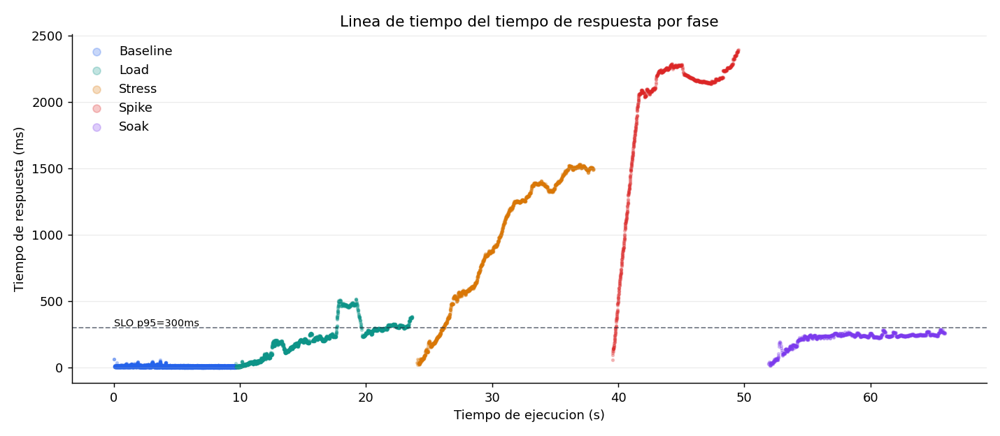
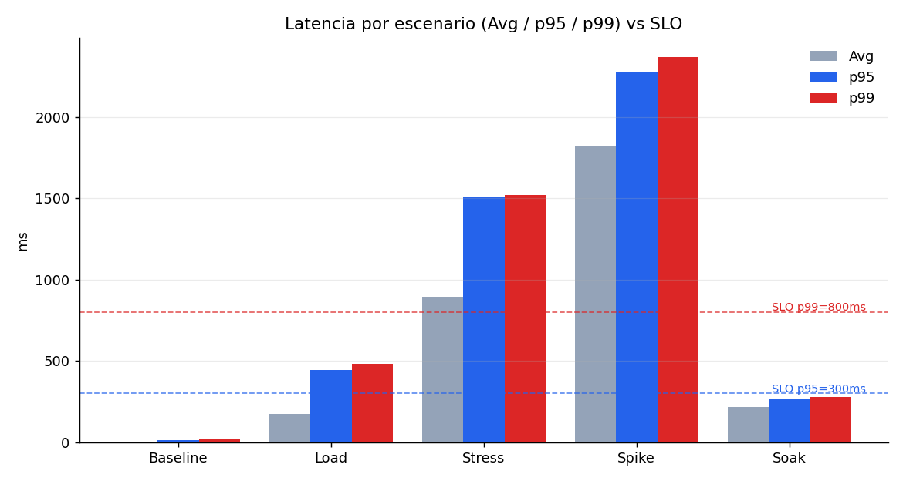
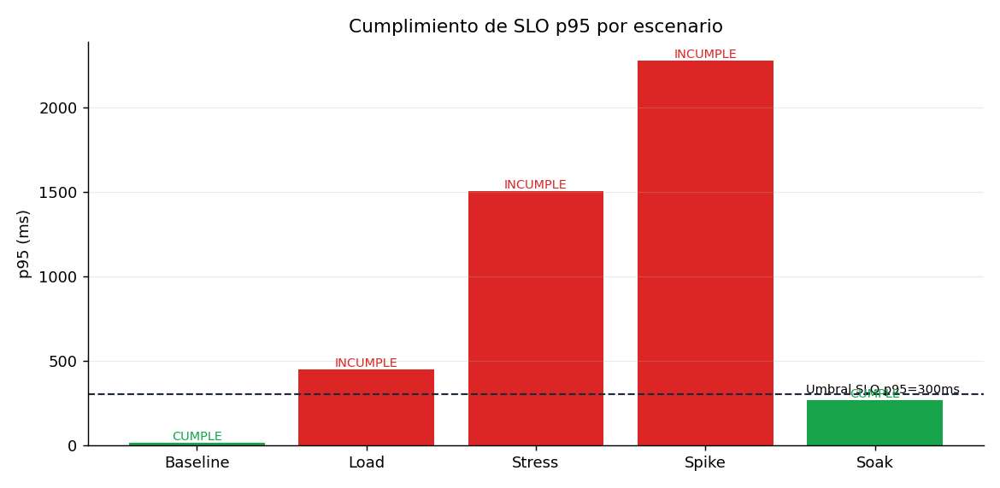
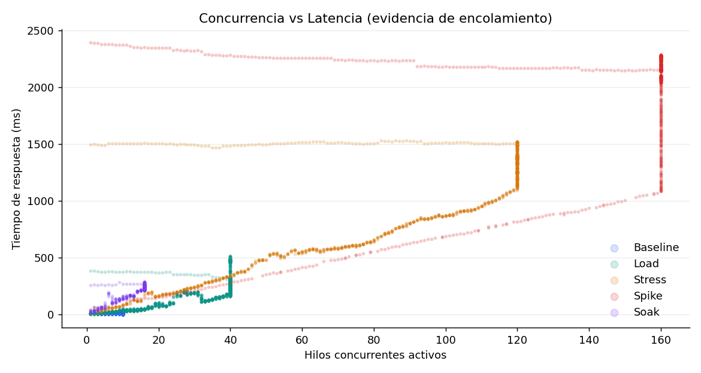

# U5 — Reporte de Ejecución y Análisis de Pruebas de Carga y Rendimiento

**Proyecto:** ParkControl · **Unidad:** Validación y verificación de resultados
**Herramienta:** Apache JMeter (ejecución no-GUI) · **Resultados:** 25.462 muestras · 5 escenarios · 0 % de errores

> Este reporte documenta una ejecución **real** del plan JMeter
> (`performance/ParkControl_LoadTest.jmx`) contra el servidor Node de
> ParkControl, con evidencia verificable (`.jtl`, estadísticas y gráficas en
> `performance/results/` y `performance/evidencias/`).

---

## 1. Objetivo

Configurar escenarios de carga con JMeter sobre la API de ParkControl, ejecutar
las pruebas y **analizar técnicamente** las métricas (tiempo de respuesta,
throughput, tasa de errores) para identificar cuellos de botella y proponer
mejoras fundamentadas.

## 2. Sistema bajo prueba

Servidor HTTP de ParkControl (`src/server/app.js`, Node.js 22) con tres
endpoints:

| Endpoint | Método | Tipo | Persistencia |
|----------|--------|------|--------------|
| `/api/dashboard` | GET | Lectura | Lee `data/parking-lot.json` |
| `/api/entries`   | POST | Escritura | Lectura + modificación + escritura del JSON |
| `/api/exits`     | POST | Escritura | Lectura + cálculo de factura + escritura del JSON |

Detalle arquitectónico clave: **todas las escrituras se serializan** en una
única cola de promesas (`updateLot`/`lotOperation` en `app.js`) para evitar
condiciones de carrera, y la persistencia reescribe **todo** el archivo JSON en
cada operación (`JsonStore.write`). Estos dos hechos son el origen del cuello de
botella analizado.

**Ambiente controlado.** El runner (`performance/run_jmeter.sh`) respalda
`data/parking-lot.json`, siembra una capacidad muy alta (para que el límite de
cupos *no* sea el factor limitante y se observe el verdadero cuello de botella de
escritura) y restaura el archivo al finalizar.

## 3. SLO definidos

| ID | SLO | Justificación |
|----|-----|---------------|
| SLO-1 | **p95 < 300 ms** | Operación interactiva de mostrador (ingreso/salida/consulta). |
| SLO-2 | **p99 < 800 ms** | Cota de la cola larga. |
| SLO-3 | **Tasa de errores < 1 %** | La operación no puede perder transacciones. |

## 4. Escenarios y parámetros

Cada escenario es un *Thread Group* parametrizado por `${__P(...)}` (usuarios,
ramp-up, duración). Ejecución **serializada** (un escenario tras otro) para
aislar cada fase.

| Escenario | Operación | Usuarios (demo/full) | Ramp-up | Duración (demo/full) |
|-----------|-----------|----------------------|---------|----------------------|
| Baseline  | `GET /api/dashboard` (lectura) | 10 / 20 | 2 / 5 s | 10 s / 2 min |
| Load      | `POST /entries` + `POST /exits` | 40 / 100 | 5 / 30 s | 14 s / 5 min |
| Stress    | `POST /entries` + `POST /exits` | 120 / 300 | 8 / 60 s | 14 s / 4 min |
| Spike     | `POST /entries` + `POST /exits` | 160 / 400 | 2 / 5 s | 10 s / 2 min |
| Soak      | `POST /entries` + `POST /exits` | 16 / 60 | 3 / 30 s | 14 s / 15 min |

**Elementos JMeter:** HTTP Request Defaults (host/puerto por `-J`), HTTP Header
Manager (`Content-Type: application/json`), Response Assertion por código HTTP
(201 para ingreso, 200 para salida/consulta), placa única por iteración con
prefijo por escenario (`${__threadNum}` + `${__counter}`) para evitar colisiones,
y listeners Summary/Aggregate Report (View Results Tree deshabilitado).

Los resultados corresponden al **perfil demo** (reproducible en ~70 s). El perfil
**full** se activa con `PROFILE=full ./performance/run_jmeter.sh`.

## 5. Métricas obtenidas

| Escenario | Muestras | Error % | Avg (ms) | p50 | p90 | p95 | p99 | Max | Throughput (req/s) | Concurrencia |
|-----------|---------:|--------:|---------:|----:|----:|----:|----:|----:|-------------------:|-------------:|
| Baseline (lectura) | 19.524 | 0.0 | 4.6   | 4   | 9    | 11     | 17     | 62   | 2.018,8 | 10  |
| Load (escritura)   | 2.683  | 0.0 | 174.8 | 185 | 317  | 446.5  | 483    | 516  | 186,7   | 40  |
| Stress (escritura) | 1.435  | 0.0 | 896.6 | 915 | 1490 | 1506   | 1520   | 1528 | 92,7    | 120 |
| Spike (escritura)  | 889    | 0.0 | 1819.1| 2147| 2270 | 2280   | 2372.1 | 2392 | 71,8    | 160 |
| Soak (escritura)   | 931    | 0.0 | 218.2 | 236 | 256  | 264    | 279    | 285  | 65,4    | 16  |

*(Datos completos en `performance/results/statistics.{csv,json}`.)*

### Evidencia visual

Captura del proceso de ejecución (JMeter no-GUI):



Throughput por escenario (la lectura escala; la escritura se desploma):



Línea de tiempo del tiempo de respuesta por fase (en Stress la latencia crece de
forma sostenida — firma del archivo que crece):



Latencia Avg/p95/p99 vs SLO y cumplimiento de SLO p95:




Concurrencia vs latencia (encolamiento):



## 6. Interpretación de resultados

**Lectura (Baseline).** `GET /api/dashboard` alcanza **~2.019 req/s** con
**p95 = 11 ms**. Las lecturas no toman el candado de escritura y solo leen el
archivo, por lo que escalan sin problema con 10 usuarios.

**Escritura (Load → Stress → Spike).** Al introducir escritura, el throughput
**cae drásticamente** y la latencia se dispara:

- **Load (40 usuarios):** throughput 186,7 req/s, pero p95 = 446 ms (ya supera el SLO-1).
- **Stress (120 usuarios):** throughput **baja** a 92,7 req/s y p95 = 1.506 ms.
- **Spike (160 usuarios):** throughput **baja aún más** a 71,8 req/s y p95 = 2.280 ms.

El throughput de escritura **no se mantiene constante, sino que decrece** al
aumentar la carga. Esto es más severo que una simple saturación: indica que el
**costo por operación crece** durante la prueba.

**Soak (16 usuarios sostenidos).** Throughput 65,4 req/s y p95 = 264 ms. Aunque
tiene la menor concurrencia, su throughput es el más bajo: cuando este escenario
se ejecuta (al final), el archivo JSON ya acumuló miles de tiquetes de las fases
anteriores, por lo que **cada escritura es más costosa**.

## 7. Identificación de cuellos de botella

Se identifican **dos cuellos de botella compuestos**:

1. **Escritura serializada (contención).** Todas las operaciones de ingreso y
   salida pasan por una única cola (`lotOperation`). Bajo concurrencia, los
   usuarios se **encolan**: la latencia crece de forma proporcional a la
   concurrencia (ver `04_concurrencia_vs_latencia.png`), mientras la lectura,
   que no se serializa, escala a ~2.000 req/s.
2. **Persistencia O(n) (archivo que crece).** Cada escritura **reescribe todo**
   el archivo `data/parking-lot.json` (`JSON.stringify` + `rename`). Como el
   historial nunca se purga, el archivo crece y el costo por escritura aumenta
   con el tiempo. Evidencia inequívoca: en Stress la latencia **sube de forma
   sostenida** durante el escenario (gráfica de línea de tiempo), y Soak —con
   solo 16 usuarios— rinde peor que Load —con 40— porque corre sobre un archivo
   mucho más grande.

La combinación produce el patrón observado: **el throughput de escritura decrece
a medida que avanza la prueba y crece la concurrencia**.

## 8. Cumplimiento de SLO

| Escenario | p95 (ms) | SLO-1 (<300) | p99 (ms) | SLO-2 (<800) | Error % | SLO-3 (<1 %) |
|-----------|---------:|:-----------:|---------:|:-----------:|--------:|:-----------:|
| Baseline | 11    | ✅ | 17     | ✅ | 0.0 | ✅ |
| Load     | 446.5 | ❌ | 483    | ✅ | 0.0 | ✅ |
| Stress   | 1506  | ❌ | 1520   | ❌ | 0.0 | ✅ |
| Spike    | 2280  | ❌ | 2372.1 | ❌ | 0.0 | ✅ |
| Soak     | 264   | ✅ | 279    | ✅ | 0.0 | ✅ |

**Conclusión:** la **lectura** cumple holgadamente. La **escritura** solo cumple
el SLO de latencia con baja concurrencia (Soak, 16 usuarios). A partir de ~40
escrituras concurrentes (Load) se incumple p95. La **capacidad segura de
escritura** se ubica por debajo de ~20–30 usuarios concurrentes. La tasa de
errores se mantuvo en **0 %** en todos los escenarios.

## 9. Propuestas de mejora (fundamentadas)

Ordenadas por impacto:

1. **Reemplazar la persistencia de archivo JSON completo por una base de datos
   transaccional** (PostgreSQL/SQLite) con escritura incremental por registro.
   Elimina el costo O(n) por operación — es la mejora de mayor impacto. *(Alto.)*
2. **Permitir escrituras concurrentes con control de concurrencia por fila /
   transacciones**, eliminando la cola global `lotOperation`. *(Alto.)*
3. **Paginar y archivar el historial** (no cargar/reescribir todos los tiquetes
   en cada operación); mantener solo los abiertos en caliente. *(Alto.)*
4. **Índice por placa y estado** para acelerar la verificación de duplicados y la
   búsqueda de tiquete abierto. *(Medio.)*
5. **Backpressure / límite de concurrencia** para degradar de forma controlada
   ante picos (responder 429/503 antes que acumular latencia de segundos). *(Medio.)*
6. **Caché de lectura del dashboard** con invalidación por escritura, para
   sostener el alto throughput de lectura aun con historial grande. *(Medio.)*

Tras (1)–(3), la regresión de rendimiento debería mostrar throughput de
escritura estable (sin decaer con el tiempo) y p95 < 300 ms a concurrencias muy
superiores.

## 10. Reproducibilidad

```bash
# Requisitos: Apache JMeter 5.x en PATH; Node.js 22+; Python 3 + matplotlib numpy
./performance/run_jmeter.sh              # perfil demo (~70 s)
PROFILE=full ./performance/run_jmeter.sh # perfil de producción
HOST=mi-host PORT=3000 ./performance/run_jmeter.sh  # contra otro despliegue
```

Salidas: `performance/results/results.jtl`, `statistics.{csv,json}`,
`jmeter-console.txt` y las gráficas en `performance/evidencias/`. El `.jmx`
también se abre y ejecuta en la GUI de JMeter 5.x.

## 11. Conclusión

ParkControl es **funcionalmente correcto** (0 % de errores en todos los
escenarios) pero **no escalable en escritura** en su forma actual: la
combinación de cola de escritura única y persistencia de archivo completo limita
el throughput y degrada la latencia con la carga y el tiempo. La lectura, en
cambio, es muy eficiente. Las mejoras propuestas atacan la causa raíz
(persistencia O(n) + serialización) y son medibles con la misma batería de
pruebas.
